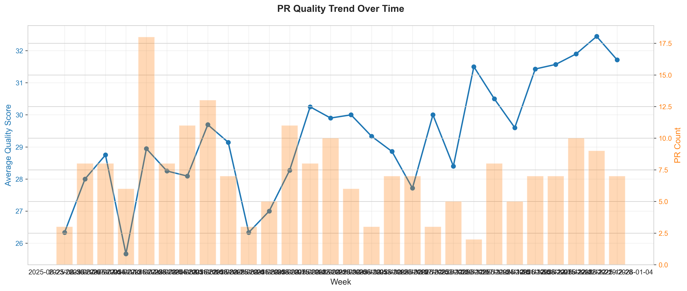
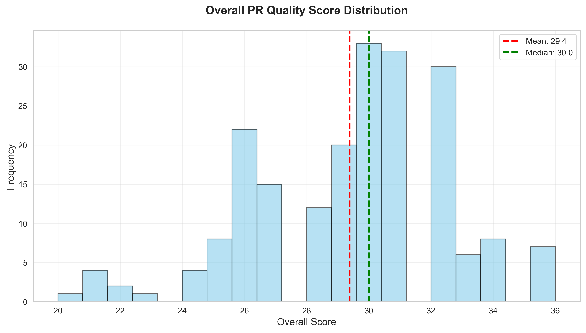
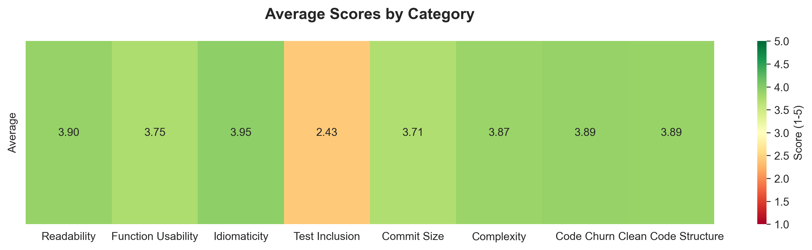
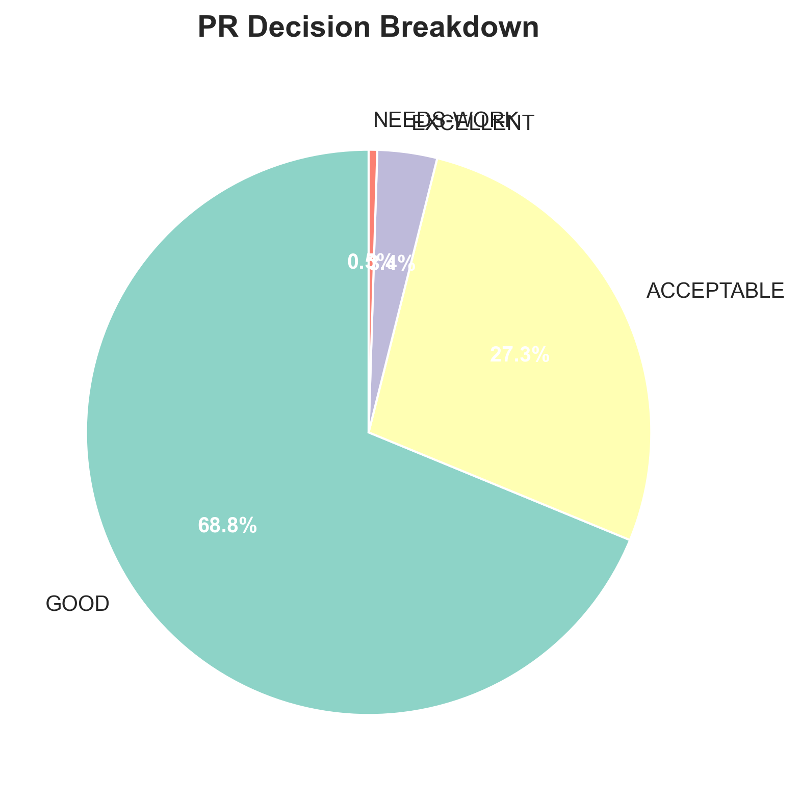
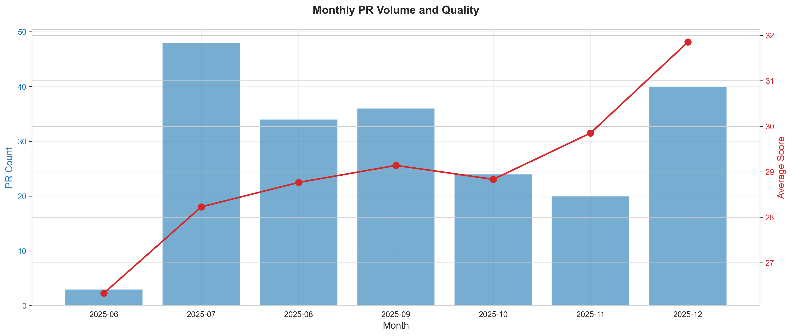

# OKR Report: adon-paper

**Period:** 2025 06 23 TO 2026 01 01 (2025-06-23 to 2026-01-01)
**Generated:** 2026-01-26 20:42:34

---

## Executive Summary

### Performance Overview
- **Total PRs:** 205
- **Repositories Contributed:** 14
- **Average Overall Score:** 29.39 / 40
- **Median Overall Score:** 30.00 / 40
- **Performance Grade:** B (Good)

### Key Achievements

**Strengths:**
1. **Idiomaticity**: 3.95/5 - ⭐⭐⭐⭐ Good
2. **Readability**: 3.90/5 - ⭐⭐⭐⭐ Good
3. **Code Churn**: 3.89/5 - ⭐⭐⭐⭐ Good

---

## Quality Metrics Breakdown

| Category | Score (1-5) | Rating |
|----------|-------------|--------|
| Idiomaticity | 3.95 | ⭐⭐⭐⭐ Good |
| Readability | 3.90 | ⭐⭐⭐⭐ Good |
| Code Churn | 3.89 | ⭐⭐⭐⭐ Good |
| Clean Code Structure | 3.89 | ⭐⭐⭐⭐ Good |
| Complexity | 3.87 | ⭐⭐⭐⭐ Good |
| Function Usability | 3.75 | ⭐⭐⭐⭐ Good |
| Commit Size | 3.71 | ⭐⭐⭐⭐ Good |
| Test Inclusion | 2.43 | ⭐⭐ Needs Work |

---

## PR Decision Distribution

| Decision | Count | Percentage |
|----------|-------|------------|
| GOOD | 141 | 68.8% |
| ACCEPTABLE | 56 | 27.3% |
| EXCELLENT | 7 | 3.4% |
| NEEDS-WORK | 1 | 0.5% |

---

## Visualizations

### Quality Trend Over Time

### Score Distribution

### Category Performance

### Decision Breakdown

### Monthly Activity

---

## Recommendations

Based on the performance analysis:

### Areas for Improvement

- **Test Inclusion** (Score: 2.43/5): Focus on improving this area

### General Recommendations

1. **Maintain Strengths**: Continue excellent performance in top-scoring categories
2. **Address Gaps**: Focus improvement efforts on categories scoring below 3.0
3. **Peer Learning**: Review high-quality PRs from top performers
4. **Best Practices**: Follow coding standards and quality guidelines consistently

---

## Repository Breakdown

| Repository | PRs | Average Score |
|------------|-----|---------------|
| paper-indonesia/paper-payment-backend | 136 | 29.00 |
| paper-indonesia/paper-document | 23 | 30.96 |
| paper-indonesia/paper-invoicer | 13 | 30.00 |
| paper-indonesia/milky-way | 8 | 29.88 |
| paper-indonesia/earth | 6 | 30.00 |
| paper-indonesia/pulumi-monitoring | 6 | 29.50 |
| paper-indonesia/pdf-generator | 3 | 28.33 |
| paper-indonesia/documentation | 2 | 31.00 |
| paper-indonesia/paper-bimasakti | 2 | 27.50 |
| paper-indonesia/paperangularapp | 2 | 30.00 |
| paper-indonesia/bromo | 1 | 30.00 |
| paper-indonesia/paper-feature-flag | 1 | 28.00 |
| paper-indonesia/snap-core-processor | 1 | 30.00 |
| paper-indonesia/stellar | 1 | 32.00 |

---

## Data Files

- **[JSON Metrics](../../../output/adon-paper/2025_06_23_to_2026_01_01/okr_metrics.json)** - Complete structured data
- **[CSV Data](../../../output/adon-paper/2025_06_23_to_2026_01_01/pr_data.csv)** - Raw PR records

---

*This report was automatically generated by the Omniscient OKR Analytics system.*
