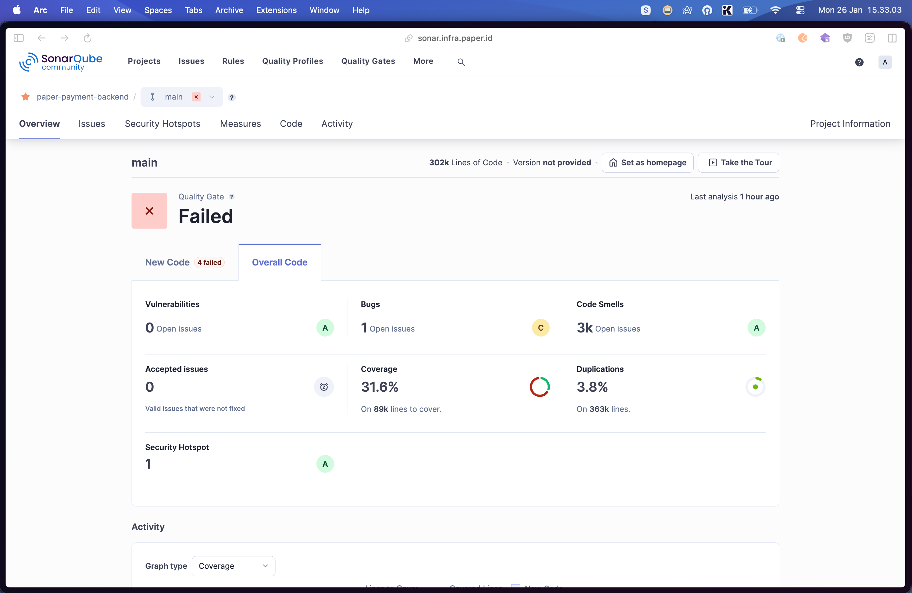
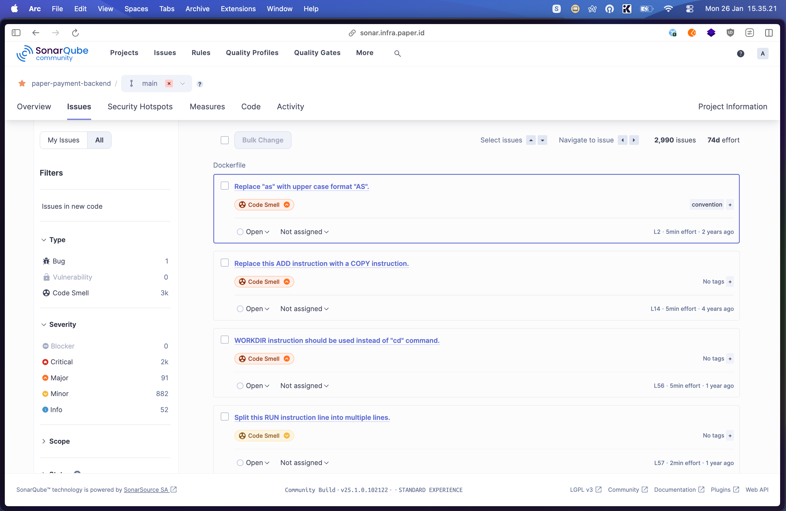
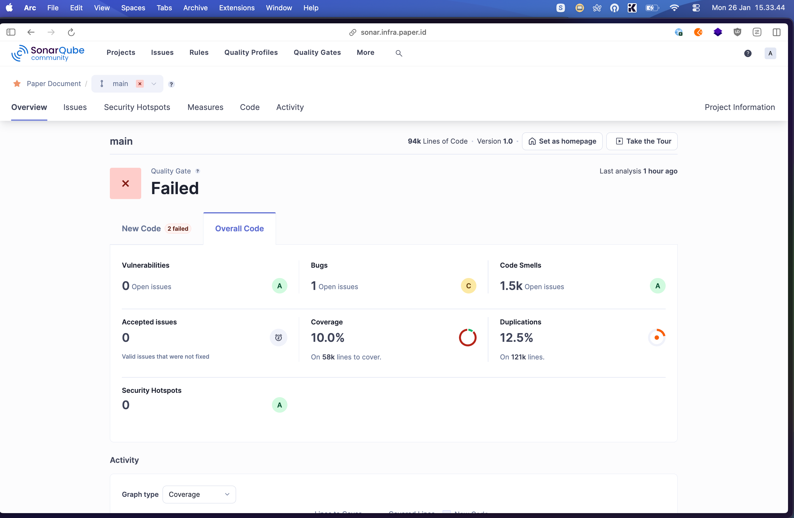
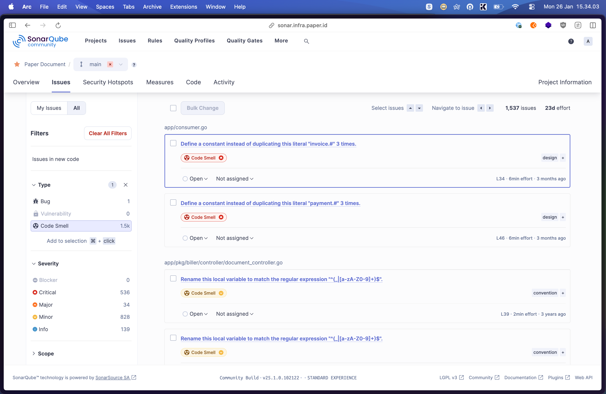

# SonarQube Analytics Report - Overall Code (Complete)
**Generated:** 2026-01-26
**Scope:** Overall codebase (not just new code)

---

## Project Links

### paper-payment-backend
🔗 **SonarQube Dashboard:** https://sonar.infra.paper.id/dashboard?id=paper-payment-backend&codeScope=overall

### paper-document
🔗 **SonarQube Dashboard:** https://sonar.infra.paper.id/dashboard?id=paper-document&codeScope=overall

---

## Executive Summary

This report contains comprehensive SonarQube analysis data for the **entire codebase**:
- **paper-payment-backend** (302k lines of code)
- **paper-document** (94k lines of code)

### Quality Gate Status
- **paper-payment-backend**: ❌ **FAILED** - [View Dashboard](https://sonar.infra.paper.id/dashboard?id=paper-payment-backend&codeScope=overall)
- **paper-document**: ❌ **FAILED** - [View Dashboard](https://sonar.infra.paper.id/dashboard?id=paper-document&codeScope=overall)

---

## Overall Code Metrics Comparison

| **Metrics** | **paper-payment-backend** |  | **paper-document** |  |
|-------------|---------------------------|------|-------------------|------|
|  | **Score/Rating** | **Proof** | **Score/Rating** | **Proof** |
| **Reliability (Bugs)** | C | 1 open issue | C | 1 open issue |
| **Security (Vulnerabilities)** | A | 0 open issues | A | 0 open issues |
| **Security Review (Security Hotspot)** | A | 1 hotspot | A | 0 hotspots |
| **Maintainability (Code Smells)** | A | 3,000 issues | A | 1,500 issues |
| **Accepted Issues** | ✅ | 0 | ✅ | 0 |
| **Total Issues** | - | 3,001 | - | 1,540 |
| **Coverage** | ❌ | **31.6%** | ❌❌ | **10.0%** |
| **Lines to Cover** | - | 89,000 lines | - | 58,000 lines |
| **Uncovered Lines** | - | ~61,000 lines | - | ~52,000 lines |
| **Duplications** | ✅ | **3.8%** | ❌❌ | **12.5%** |
| **Duplicated Lines** | - | ~11,500 lines | - | ~11,750 lines |
| **Lines of Code (NCLOC)** | - | 302,000 | - | 94,000 |

**Legend:** 
- ✅ Good (passing threshold)
- ⚠️ Warning (needs attention)
- ❌ Critical (failing threshold)
- ❌❌ Severe (far below threshold)
- A/B/C/D/E = SonarQube reliability/security ratings (A is best)

---

## Critical Comparison

### Coverage Comparison
```
paper-payment-backend:  ████████░░░░░░░░░░░░  31.6% ❌
paper-document:         ██░░░░░░░░░░░░░░░░░░  10.0% ❌❌ (SEVERE)
Target:                 ████████████████████  80.0%
```

### Duplication Comparison
```
paper-payment-backend:  ███░  3.8% ✅ (slightly over)
paper-document:         ████████████░  12.5% ❌❌ (SEVERE)
Threshold:              ███  3.0%
```

**🚨 CRITICAL:** paper-document has SEVERE quality issues:
- Coverage is **70 percentage points** below target
- Duplications are **4x higher** than threshold

---

## Detailed Breakdown

### paper-payment-backend (Overall Codebase)
🔗 [View in SonarQube](https://sonar.infra.paper.id/dashboard?id=paper-payment-backend&codeScope=overall)

#### Visual Overview


#### Lines of Code
- **Total:** 302,000 lines
- **Lines to Cover:** 89,000 (29.5%)
- **Covered:** ~28,000 lines (31.6%)
- **Uncovered:** ~61,000 lines (68.4%)

#### Reliability
- **Bugs:** 1 open issue (C rating)
- **Bug Density:** 0.003 bugs per 1,000 lines
- **Status:** Acceptable

#### Security
- **Vulnerabilities:** 0 open issues (A rating)  
- **Security Hotspots:** 1 hotspot (A rating)
- **Status:** Good security posture

#### Maintainability
- **Code Smells:** 3,000 open issues (A rating)
- **Smell Density:** ~10 code smells per 1,000 lines
- **Common issues:**
  - Cognitive complexity violations
  - String literal duplications
  - Naming convention violations
  - Empty function implementations

#### Test Coverage
- **Coverage:** 31.6% ❌
- **Gap to 80%:** 48.4 percentage points
- **Additional lines needed:** ~43,200 lines

#### Code Duplication
- **Duplication:** 3.8% ✅
- **Duplicated Lines:** ~11,476 lines
- **Threshold:** 3% (0.8% over)
- **Status:** Acceptable but could be improved

#### Issues Breakdown


---

### paper-document (Overall Codebase)
🔗 [View in SonarQube](https://sonar.infra.paper.id/dashboard?id=paper-document&codeScope=overall)

#### Visual Overview


#### Lines of Code
- **Total:** 94,000 lines
- **Lines to Cover:** 58,000 (61.7%)
- **Covered:** ~5,800 lines (10.0%)
- **Uncovered:** ~52,200 lines (90.0%)

#### Reliability
- **Bugs:** 1 open issue (C rating)
- **Bug Density:** 0.011 bugs per 1,000 lines
- **Status:** Acceptable

#### Security
- **Vulnerabilities:** 0 open issues (A rating)  
- **Security Hotspots:** 0 hotspots (A rating)
- **Status:** Excellent security posture

#### Maintainability
- **Code Smells:** 1,500 open issues (A rating)
- **Smell Density:** ~16 code smells per 1,000 lines
- **Status:** Higher density than paper-payment-backend

#### Test Coverage 🚨
- **Coverage:** 10.0% ❌❌ **SEVERE**
- **Gap to 80%:** 70 percentage points
- **Additional lines needed:** ~40,600 lines
- **Status:** **CRITICAL PRIORITY** - Extremely low coverage

#### Code Duplication 🚨
- **Duplication:** 12.5% ❌❌ **SEVERE**
- **Duplicated Lines:** ~11,750 lines
- **Threshold:** 3% (9.5% over)
- **Status:** **CRITICAL** - 4x higher than acceptable
- **Impact:** On 121k total lines (including comments/blanks)

#### Issues Breakdown


---

## Side-by-Side Comparison

| Metric | paper-payment-backend | paper-document | Winner |
|--------|---------------------|----------------|--------|
| **Lines of Code** | 302,000 | 94,000 | - |
| **Coverage** | 31.6% ❌ | 10.0% ❌❌ | ✅ Backend |
| **Duplications** | 3.8% ✅ | 12.5% ❌❌ | ✅ Backend |
| **Bugs** | 1 (C) | 1 (C) | 🟰 Tie |
| **Vulnerabilities** | 0 (A) | 0 (A) | 🟰 Tie |
| **Code Smells** | 3,000 | 1,500 | ✅ Document (fewer) |
| **Smell Density** | 10/1k LOC | 16/1k LOC | ✅ Backend |
| **Security Hotspots** | 1 | 0 | ✅ Document |
| **Total Issues** | 3,001 | 1,540 | ✅ Document (fewer) |

**Overall Winner:** paper-payment-backend (better coverage and duplications)

---

## Comparison: Overall vs New Code

### paper-payment-backend

| Metric | Overall Code | New Code | Delta | Trend |
|--------|-------------|----------|-------|-------|
| **Coverage** | 31.6% ❌ | 40.0% ⚠️ | +8.4% | ✅ Improving |
| **Duplications** | 3.8% ✅ | 3.21% ✅ | -0.6% | ✅ Improving |

### paper-document

| Metric | Overall Code | New Code | Delta | Trend |
|--------|-------------|----------|-------|-------|
| **Coverage** | 10.0% ❌❌ | 26.6% ❌ | +16.6% | ✅ Improving |
| **Duplications** | 12.5% ❌❌ | 5.73% ❌ | -6.8% | ✅ Improving |

**Key Observation:** Both projects show **significantly better quality in new code**, indicating improved development practices. However, legacy code quality remains poor, especially in paper-document.

---

## Severity Distribution (All Issues)

### paper-payment-backend
```
Total: 3,001 issues
├── Blocker:     0 (0.0%)
├── Critical: 1,971 (65.7%) ⚠️
├── Major:      93 (3.1%)
├── Minor:     883 (29.4%)
└── Info:       54 (1.8%)
```

### paper-document
```
Total: 1,540 issues
├── Blocker:     0 (0.0%)
├── Critical:  334 (21.7%)
├── Major:      23 (1.5%)
├── Minor:     548 (35.6%)
└── Info:      635 (41.2%)
```

---

## 🚨 Critical Priority Rankings

### P0 - Immediate Action Required

#### 1. paper-document: Catastrophic Test Coverage (10.0%)
- **Status:** 🔥 **EMERGENCY**
- **Current:** 10.0% (5,800 lines covered)
- **Target:** 80% (46,400 lines)
- **Gap:** 40,600 lines need coverage
- **Risk:** Extremely high - changes likely to introduce bugs
- **Dashboard:** https://sonar.infra.paper.id/dashboard?id=paper-document&codeScope=overall
- **Action:** Emergency testing sprint required

#### 2. paper-document: Severe Code Duplication (12.5%)
- **Status:** 🔥 **CRITICAL**
- **Current:** 12.5% (~11,750 lines)
- **Target:** <3%
- **Gap:** 9.5 percentage points over
- **Risk:** High maintenance cost, bug propagation
- **Dashboard:** https://sonar.infra.paper.id/dashboard?id=paper-document&codeScope=overall
- **Action:** Major refactoring initiative needed

#### 3. paper-payment-backend: Low Test Coverage (31.6%)
- **Status:** ❌ **HIGH PRIORITY**
- **Current:** 31.6%
- **Target:** 80%
- **Gap:** 43,200 lines
- **Dashboard:** https://sonar.infra.paper.id/dashboard?id=paper-payment-backend&codeScope=overall
- **Action:** Increase coverage 5% per sprint

---

## Monthly Trend Analysis

### paper-payment-backend
| Month | Issues | Growth |
|-------|--------|--------|
| Jul 2025 | 1,638 | - |
| Aug 2025 | 1,694 | +56 |
| Sep 2025 | 2,339 | +645 🔴 |
| Oct 2025 | 2,553 | +214 |
| Nov 2025 | 2,647 | +94 |
| Dec 2025 | 2,898 | +251 |
| Jan 2026 | 3,001 | +103 |

**Total Growth:** +1,363 (83% increase)

### paper-document
| Month | Issues | Growth |
|-------|--------|--------|
| Jul 2025 | 1,356 | - |
| Aug 2025 | 1,379 | +23 |
| Sep 2025 | 1,393 | +14 |
| Oct 2025 | 1,475 | +82 |
| Nov 2025 | 1,475 | 0 |
| Dec 2025 | 1,494 | +19 |
| Jan 2026 | 1,540 | +46 |

**Total Growth:** +184 (14% increase)

---

## Data Sources

- **SonarQube Server:** https://sonar.infra.paper.id
- **Query Date:** 2026-01-26
- **Projects:**
  - paper-payment-backend: https://sonar.infra.paper.id/dashboard?id=paper-payment-backend&codeScope=overall
  - paper-document: https://sonar.infra.paper.id/dashboard?id=paper-document&codeScope=overall
- **Total Issues:** 4,541
- **Data Scope:** Complete codebase (overall code, not just new code)

---

**Report Owner:** DevOps/Quality Assurance Team
**Next Review:** Weekly until paper-document reaches 30% coverage

