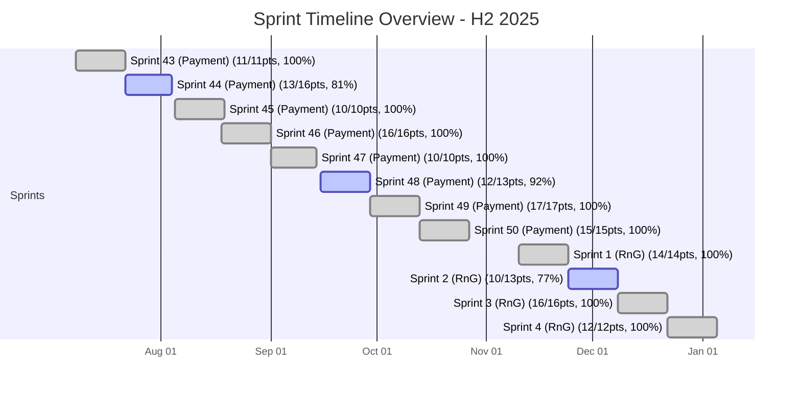

# Sprint Analytics Report - H2 2025
## SMB Payment Team

*Generated: 2026-01-26 15:22:32*

---

## Executive Summary

**Total Sprints Analyzed:** 12

**Total Points Delivered:** 156 / 163

**Average Delivery Rate:** 95.9%

**Average Velocity:** 13.0 points/sprint

### Performance Highlights

**Best Sprint:** Sprint 43 (Payment) (100.0% delivery rate)

**Worst Sprint:** Sprint 2 (RnG) (76.9% delivery rate)

### Key Insights

- Delivery rate remains **consistent** (avg: 95.9%)
- Very **consistent velocity** (σ = 2.45 points)
- **Strong performance**: 9 out of 12 sprints achieved 100%+ delivery rate

## Visualizations

### Sprint Timeline Overview

*Timeline view of all sprints with delivery performance*

**Legend:**
- 🟢 Green (done) = Perfect delivery (≥100%)
- 🔵 Blue (active) = Good performance (≥75%)
- 🔴 Red (crit) = Needs attention (<75%)

### Sprint Velocity

*Comparison of Points Committed, Delivered, and Carried Over across sprints*

### Burndown Trend

*Points remaining (burndown) over time*

### Delivery Rate

*Percentage of work delivered per sprint (target: 100%)*

## Overall Statistics

| Metric | Value |
|--------|-------|
| Total Committed | 163 points |
| Total Carryover In | 0 points |
| Total Work | 163 points |
| Total Delivered | 156 points |
| Total Carryover Out | 0 points |
| Velocity Consistency (σ) | 2.45 points |

## Sprint-by-Sprint Breakdown

### [Sprint 43 (Payment)](https://app.clickup.com/3708016/v/li/901609751709)

**Jul 8-22, 2025**

📊 **[Sprint Reporting Dashboard](https://app.clickup.com/3708016/v/3h53g-249216)**

🌟 **Perfect Sprint!**

| Metric | Value |
|--------|-------|
| 📅 Date Range | Jul 8-22, 2025 |
| 📊 Points Committed | 11 |
| ⬆️ Carryover In | 0 |
| 💼 Total Work | 11 |
| ✅ Points Delivered | 11 |
| ⬇️ Carryover Out | 0 |
| 🔥 Burndown | 0 |
| 🎯 **Delivery Rate** | **100.0%** |
| 📋 Tasks Completed | 3 / 3 |

**Completed Tasks:**

- [[Pivot][BE] Pivot Callback](https://app.clickup.com/t/86czgvnrn) - 5 pts
- [[Pivot][BE] Request 3DS](https://app.clickup.com/t/86czgvnr5) - 3 pts
- [[Pivot][BE] Validate Payment](https://app.clickup.com/t/86czgvnp8) - 3 pts

---

### [Sprint 44 (Payment)](https://app.clickup.com/3708016/v/li/901610062693)

**Jul 22 - Aug 04, 2025**

📊 **[Sprint Reporting Dashboard](https://app.clickup.com/3708016/v/3h53g-252156)**

👍 **Good Performance**

| Metric | Value |
|--------|-------|
| 📅 Date Range | Jul 22 - Aug 04, 2025 |
| 📊 Points Committed | 16 |
| ⬆️ Carryover In | 0 |
| 💼 Total Work | 16 |
| ✅ Points Delivered | 13 |
| ⬇️ Carryover Out | 0 |
| 🔥 Burndown | 3 |
| 🎯 **Delivery Rate** | **81.2%** |
| 📋 Tasks Completed | 7 / 8 |

**Completed Tasks:**

- [Phase 3: High Risk (Core Payment Operations)](https://app.clickup.com/t/86cztvegc) - 0 pts
- [Phase 2: Medium Risk (Verification & Sync)](https://app.clickup.com/t/86cztvedm) - 0 pts
- [Phase 1: Low Risk (Non-Critical Operations)](https://app.clickup.com/t/86cztvea7) - 0 pts
- [BE](https://app.clickup.com/t/86czqwy7a) - 3 pts
- [[Bug Fix] [BE] Fix Static VA creation not including mitra](https://app.clickup.com/t/86czqc3vd) - 2 pts
- [[PaperXB] Multi Currency Invoice Payment Disbursement PDF](https://app.clickup.com/t/86cznprpu) - 5 pts
- [[Instant Payment] [BE] Alert and Monitoring](https://app.clickup.com/t/86cznmmrn) - 3 pts

---

### [Sprint 45 (Payment)](https://app.clickup.com/3708016/v/li/901610251697)

**Aug 5-19, 2025**

📊 **[Sprint Reporting Dashboard](https://app.clickup.com/3708016/v/3h53g-253476)**

*Tanggal Merah: 🔴 Aug 17 (Hari Kemerdekaan Indonesia)*

🌟 **Perfect Sprint!**

| Metric | Value |
|--------|-------|
| 📅 Date Range | Aug 5-19, 2025 |
| 📊 Points Committed | 10 |
| ⬆️ Carryover In | 0 |
| 💼 Total Work | 10 |
| ✅ Points Delivered | 10 |
| ⬇️ Carryover Out | 0 |
| 🔥 Burndown | 0 |
| 🎯 **Delivery Rate** | **100.0%** |
| 📋 Tasks Completed | 3 / 3 |

**Completed Tasks:**

- [[Pivot] Use External ID as Reference ID](https://app.clickup.com/t/86czupph7) - 3 pts
- [[PaperXB] Proof of Payment PDF for Multi Currencies XB Transactions](https://app.clickup.com/t/86czuppd4) - 5 pts
- [[BE] Flagging to include KYB users for BCA VA](https://app.clickup.com/t/86czukrtb) - 2 pts

---

### [Sprint 46 (Payment)](https://app.clickup.com/3708016/v/li/901610523078)

**Aug 18 - Sep 01, 2025**

📊 **[Sprint Reporting Dashboard](https://app.clickup.com/3708016/v/3h53g-257436)**

🌟 **Perfect Sprint!**

| Metric | Value |
|--------|-------|
| 📅 Date Range | Aug 18 - Sep 01, 2025 |
| 📊 Points Committed | 16 |
| ⬆️ Carryover In | 0 |
| 💼 Total Work | 16 |
| ✅ Points Delivered | 16 |
| ⬇️ Carryover Out | 0 |
| 🔥 Burndown | 0 |
| 🎯 **Delivery Rate** | **100.0%** |
| 📋 Tasks Completed | 5 / 5 |

**Completed Tasks:**

- [[Revamp Fee] [BE] Counter Data Injection](https://app.clickup.com/t/86d00q44f) - 5 pts
- [[SMBC] Adjust ASPI Review](https://app.clickup.com/t/86czzf0mq) - 2 pts
- [[BE] Static VA Supplier Fee](https://app.clickup.com/t/86czxhg22) - 3 pts
- [[Revamp Fee] [BE] Dynamic VA Fee Counter](https://app.clickup.com/t/86czwh6zg) - 3 pts
- [[PaperXB] Multi Currency Invoice Payment Notification WhatsApp Message](https://app.clickup.com/t/86cznprb8) - 3 pts

---

### [Sprint 47 (Payment)](https://app.clickup.com/3708016/v/li/901610830843)

**Sep 1-14, 2025**

📊 **[Sprint Reporting Dashboard](https://app.clickup.com/3708016/v/3h53g-260056)**

🌟 **Perfect Sprint!**

| Metric | Value |
|--------|-------|
| 📅 Date Range | Sep 1-14, 2025 |
| 📊 Points Committed | 10 |
| ⬆️ Carryover In | 0 |
| 💼 Total Work | 10 |
| ✅ Points Delivered | 10 |
| ⬇️ Carryover Out | 0 |
| 🔥 Burndown | 0 |
| 🎯 **Delivery Rate** | **100.0%** |
| 📋 Tasks Completed | 4 / 4 |

**Completed Tasks:**

- [[PaperXB] Mapping Currency with Benef Type for Alipay - CNY](https://app.clickup.com/t/86d0581na) - 2 pts
- [[PaperXB] Alipay - Create Beneficiary and Remitter](https://app.clickup.com/t/86czz4tr7) - 3 pts
- [[PaperXB] Alipay - Adjust Create Remitter Endpoint](https://app.clickup.com/t/86czz4pkw) - 3 pts
- [[PaperXB] Alipay - Make Prefill Support Individual Remitter](https://app.clickup.com/t/86czz4pe5) - 2 pts

---

### [Sprint 48 (Payment)](https://app.clickup.com/3708016/v/li/901611066339)

**Sep 15-29, 2025**

📊 **[Sprint Reporting Dashboard](https://app.clickup.com/3708016/v/3h53g-261776)**

*Tanggal Merah: 🔴 Sep 16 (Maulid Nabi Muhammad SAW)*

✅ **Excellent Performance**

| Metric | Value |
|--------|-------|
| 📅 Date Range | Sep 15-29, 2025 |
| 📊 Points Committed | 13 |
| ⬆️ Carryover In | 0 |
| 💼 Total Work | 13 |
| ✅ Points Delivered | 12 |
| ⬇️ Carryover Out | 0 |
| 🔥 Burndown | 1 |
| 🎯 **Delivery Rate** | **92.3%** |
| 📋 Tasks Completed | 5 / 6 |

**Completed Tasks:**

- [Adjust DPR creation to include entry point](https://app.clickup.com/t/86d0dpc8v) - 1 pts
- [[Promo Engine][BE] KYB KYC Verification Status Prameter](https://app.clickup.com/t/86d0ahcut) - 2 pts
- [[Improvement] Blacklist BIN per Company](https://app.clickup.com/t/86d094gjt) - 3 pts
- [[Bank Validation] Caching Solution](https://app.clickup.com/t/86d094fut) - 3 pts
- [[Promo Engine] [BE] Entry Point to Cater Accurate & First Accurate Parameter](https://app.clickup.com/t/86d094ffy) - 3 pts

---

### [Sprint 49 (Payment)](https://app.clickup.com/3708016/v/li/901611303982)

**Sep 29 - Oct 13, 2025**

📊 **[Sprint Reporting Dashboard](https://app.clickup.com/3708016/v/3h53g-264736)**

🌟 **Perfect Sprint!**

| Metric | Value |
|--------|-------|
| 📅 Date Range | Sep 29 - Oct 13, 2025 |
| 📊 Points Committed | 17 |
| ⬆️ Carryover In | 0 |
| 💼 Total Work | 17 |
| ✅ Points Delivered | 17 |
| ⬇️ Carryover Out | 0 |
| 🔥 Burndown | 0 |
| 🎯 **Delivery Rate** | **100.0%** |
| 📋 Tasks Completed | 8 / 8 |

**Completed Tasks:**

- [[BE] Update Whitelisted Company for MID Routing & Custom Fee 1.3%](https://app.clickup.com/t/86d0gbvbn) - 1 pts
- [[PG Routing] As a System I want to be Able to Set the Routing Based on the Company ID and BIN](https://app.clickup.com/t/86d0f1ztk) - 3 pts
- [[PaperXB] Delete all remitter when user change their company type](https://app.clickup.com/t/86d0efvyc) - 2 pts
- [[Finops] Validate Disbursements](https://app.clickup.com/t/86d0edk1x) - 3 pts
- [[Finops] Handle Xendit Success/Failed Callback](https://app.clickup.com/t/86d0edb7k) - 2 pts
- [[Finops] Process Single Disbursement + In Progress Callback](https://app.clickup.com/t/86d0eda9k) - 3 pts
- [[Finops] Internal Batch Disburse API](https://app.clickup.com/t/86d0eda42) - 2 pts
- [[Copywriting] Replace "Disbursement" in Pay In into "Withdrawal"](https://app.clickup.com/t/86d0e6dw8) - 1 pts

---

### [Sprint 50 (Payment)](https://app.clickup.com/3708016/v/li/901611529803)

**Oct 13-27, 2025**

📊 **[Sprint Reporting Dashboard](https://app.clickup.com/3708016/v/3h53g-267836)**

🌟 **Perfect Sprint!**

| Metric | Value |
|--------|-------|
| 📅 Date Range | Oct 13-27, 2025 |
| 📊 Points Committed | 15 |
| ⬆️ Carryover In | 0 |
| 💼 Total Work | 15 |
| ✅ Points Delivered | 15 |
| ⬇️ Carryover Out | 0 |
| 🔥 Burndown | 0 |
| 🎯 **Delivery Rate** | **100.0%** |
| 📋 Tasks Completed | 6 / 6 |

**Completed Tasks:**

- [[Backend] Check backend to backend Validate Promotion When create DPT](https://app.clickup.com/t/86d0kmb0y) - 1 pts
- [[Backend] - Handle Confirm Response from Pivot, Return 400 Should be Failed the Transactions](https://app.clickup.com/t/86d0k5rg1) - 3 pts
- [[Backend]](https://app.clickup.com/t/86d0j88x4) - 3 pts
- [[Finops] Handle Pivot (Bulk) Success/Failed Callback](https://app.clickup.com/t/86d0edbbw) - 2 pts
- [[Finops] Process Bulk Disbursement + In Progress Callback](https://app.clickup.com/t/86d0edak4) - 3 pts
- [[Finops] Integrate Pivot Local Disbursements](https://app.clickup.com/t/86d0ed9wr) - 3 pts

---

### [Sprint 1 (RnG)](https://app.clickup.com/3708016/v/li/901611807487)

**Nov 10-24, 2025**

📊 **[Sprint Reporting Dashboard](https://app.clickup.com/3708016/v/3h53g-271756)**

🌟 **Perfect Sprint!**

| Metric | Value |
|--------|-------|
| 📅 Date Range | Nov 10-24, 2025 |
| 📊 Points Committed | 14 |
| ⬆️ Carryover In | 0 |
| 💼 Total Work | 14 |
| ✅ Points Delivered | 14 |
| ⬇️ Carryover Out | 0 |
| 🔥 Burndown | 0 |
| 🎯 **Delivery Rate** | **100.0%** |
| 📋 Tasks Completed | 5 / 5 |

**Completed Tasks:**

- [[Backend] - Alert When Pivot Transaction Threshold is Reached](https://app.clickup.com/t/86d0xxvma) - 2 pts
- [[PaperXB][BE]Supplier Info PI - Validate only KYB user to pay CNY and min 10 CNY ](https://app.clickup.com/t/86d0vvrw2) - 2 pts
- [[BE] Notifications for batch 1A finOps disbursements](https://app.clickup.com/t/86d0tmuab) - 2 pts
- [[Transaction History][BE] Generated PDF design requirements for payOut](https://app.clickup.com/t/86d0tmnhf) - 5 pts
- [[PaperXB][BE] China Banks - AA Non-Individual company user IWT do the transactions to my Supplier's China Bank Account](https://app.clickup.com/t/86d0pt8c8) - 3 pts

---

### [Sprint 2 (RnG)](https://app.clickup.com/3708016/v/li/901612239615)

**Nov 24 - Dec 08, 2025**

📊 **[Sprint Reporting Dashboard](https://app.clickup.com/3708016/v/3h53g-276336)**

👍 **Good Performance**

| Metric | Value |
|--------|-------|
| 📅 Date Range | Nov 24 - Dec 08, 2025 |
| 📊 Points Committed | 13 |
| ⬆️ Carryover In | 0 |
| 💼 Total Work | 13 |
| ✅ Points Delivered | 10 |
| ⬇️ Carryover Out | 0 |
| 🔥 Burndown | 3 |
| 🎯 **Delivery Rate** | **76.9%** |
| 📋 Tasks Completed | 7 / 8 |

**Completed Tasks:**

- [Refund Charged CC](https://app.clickup.com/t/86d1223c8) - 0 pts
- [Cancel Auth](https://app.clickup.com/t/86d1223bd) - 0 pts
- [[Backend] Multicards - Cancel API](https://app.clickup.com/t/86d10hkcy) - 5 pts
- [[Backend] - Add notification to notifier tab if DPR status updated to expired](https://app.clickup.com/t/86d0ed0p3) - 1 pts
- [[Backend] - Add new cron job to check and update DPR status to expired if pending after 72 hours](https://app.clickup.com/t/86d0ed0d6) - 2 pts
- [[Multicards Payment] AA System IWT Have Cron Job to Handle Expired DPR in Multiple Card Payment When DPR Status still in Pending Status After 72 Hours (Configurable) Then cancel All DPT Auth and Set DPR Status to Expired](https://app.clickup.com/t/86d0ecxzv) - 0 pts
- [[Tech/Data][Payment BE] As finops, I want the disbursement requests to various PG SoFs to be automatically processed after approved](https://app.clickup.com/t/86czu65d2) - 2 pts

---

### [Sprint 3 (RnG)](https://app.clickup.com/3708016/v/li/901612467459)

**Dec 8-22, 2025**

📊 **[Sprint Reporting Dashboard](https://app.clickup.com/3708016/v/3h53g-278676)**

🌟 **Perfect Sprint!**

| Metric | Value |
|--------|-------|
| 📅 Date Range | Dec 8-22, 2025 |
| 📊 Points Committed | 16 |
| ⬆️ Carryover In | 0 |
| 💼 Total Work | 16 |
| ✅ Points Delivered | 16 |
| ⬇️ Carryover Out | 0 |
| 🔥 Burndown | 0 |
| 🎯 **Delivery Rate** | **100.0%** |
| 📋 Tasks Completed | 7 / 7 |

**Completed Tasks:**

- [[BE]](https://app.clickup.com/t/86d177rkz) - 2 pts
- [[Tech/Data][Payment BE] As finops, I want the disbursement requests to various PG SoFs to be automatically processed after approved](https://app.clickup.com/t/86d177e2w) - 2 pts
- [[Pivot Integration] Add X_merchant_id & MID Label for the Unified Payment CC](https://app.clickup.com/t/86d17210m) - 3 pts
- [[BE][PaperXB-KRW] Save beneficiary email bank account & send bankCode when create payment session](https://app.clickup.com/t/86d15435h) - 3 pts
- [[PaperXB][BE] Hongkong CNH -  Default Currency & Minum Amount for XB Enums](https://app.clickup.com/t/86d153z35) - 2 pts
- [[PaperXB][BE] Hongkong CNH - AA Non-Individual company user IWT do the transactions to my Supplier's Hongkong Bank Account](https://app.clickup.com/t/86d153z2h) - 1 pts
- [[Foreign CC][BE] As paper internal user, I want to see incoming foreign CC registration requests from paper users](https://app.clickup.com/t/86d131urr) - 3 pts

---

### [Sprint 4 (RnG)](https://app.clickup.com/3708016/v/li/901612677684)

**Dec 22 - Jan 05, 2025**

📊 **[Sprint Reporting Dashboard](https://app.clickup.com/3708016/v/3h53g-281456)**

*Tanggal Merah: 🔴 Dec 25 (Hari Raya Natal), 🔴 Dec 26 (Cuti Bersama Natal)*

🌟 **Perfect Sprint!**

| Metric | Value |
|--------|-------|
| 📅 Date Range | Dec 22 - Jan 05, 2025 |
| 📊 Points Committed | 12 |
| ⬆️ Carryover In | 0 |
| 💼 Total Work | 12 |
| ✅ Points Delivered | 12 |
| ⬇️ Carryover Out | 0 |
| 🔥 Burndown | 0 |
| 🎯 **Delivery Rate** | **100.0%** |
| 📋 Tasks Completed | 6 / 6 |

**Completed Tasks:**

- [[PaperXB] Opening new corridor batch Dec](https://app.clickup.com/t/86d1dh984) - 2 pts
- [[BE] Intercon - Adjust Sales Invoice PDF downloaded](https://app.clickup.com/t/86d1bnnrv) - 3 pts
- [Payment - Publish auto disburse data to finops](https://app.clickup.com/t/86d1bmw78) - 1 pts
- [[PaperXB] Add prefix to reference id when create pivot payout session](https://app.clickup.com/t/86d19jkru) - 1 pts
- [[PaperXB] Save Pivot Rate daily in table](https://app.clickup.com/t/86d180r43) - 2 pts
- [[BE] AA Ops IWT be notified when there is a refund from Pivot](https://app.clickup.com/t/86d17va1v) - 3 pts

---

---

## About This Report

This report was automatically generated by the Sprint Analytics system.

**Report Contents:**

- Executive summary with key performance indicators
- Visual charts for velocity, burndown, and delivery rate
- Detailed sprint-by-sprint breakdown with task lists
- Indonesian public holiday indicators
- Automated insights and recommendations

**Files Generated:**

- `sprint_summary.md` - This comprehensive report
- `sprint_metrics.json` - Complete data in JSON format
- `sprint_metrics.csv` - Summary data for Excel/Sheets
- `sprint_velocity_chart.png` - Velocity comparison chart
- `sprint_burndown_chart.png` - Burndown trend chart
- `sprint_delivery_rate_chart.png` - Delivery rate chart

**Legend:**

- 🌟 Perfect Sprint (≥100% delivery)
- ✅ Excellent Performance (90-99%)
- 👍 Good Performance (75-89%)
- ⚠️ Needs Improvement (50-74%)
- ❌ Critical (<50%)
- 🔴 Tanggal Merah (Indonesian Public Holiday)
