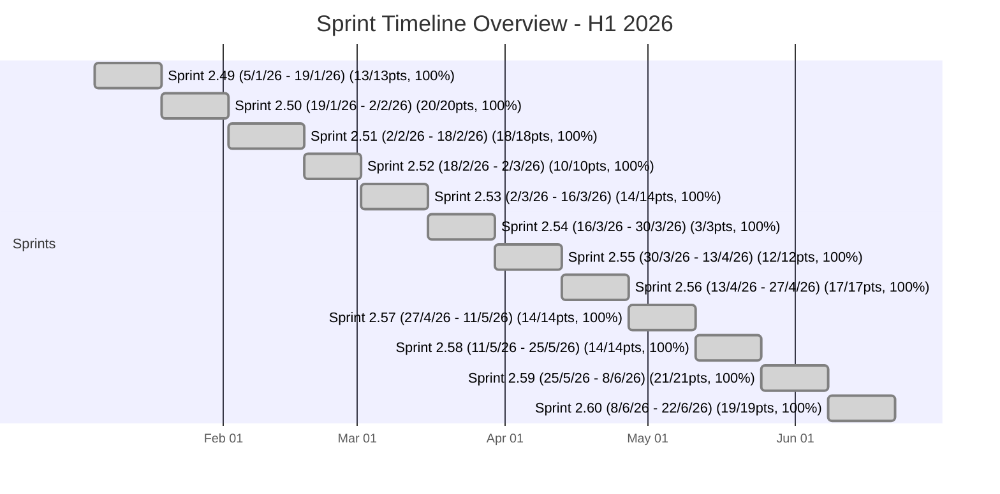
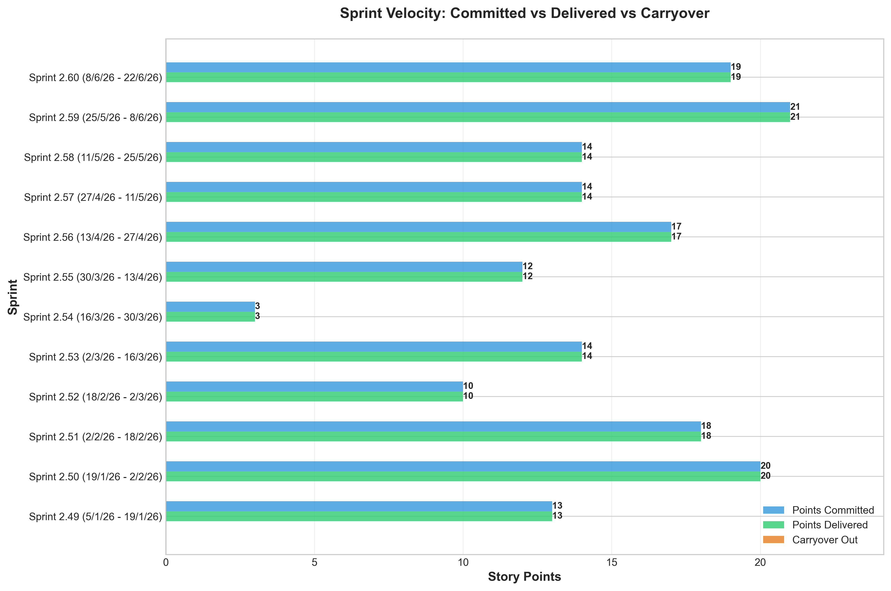
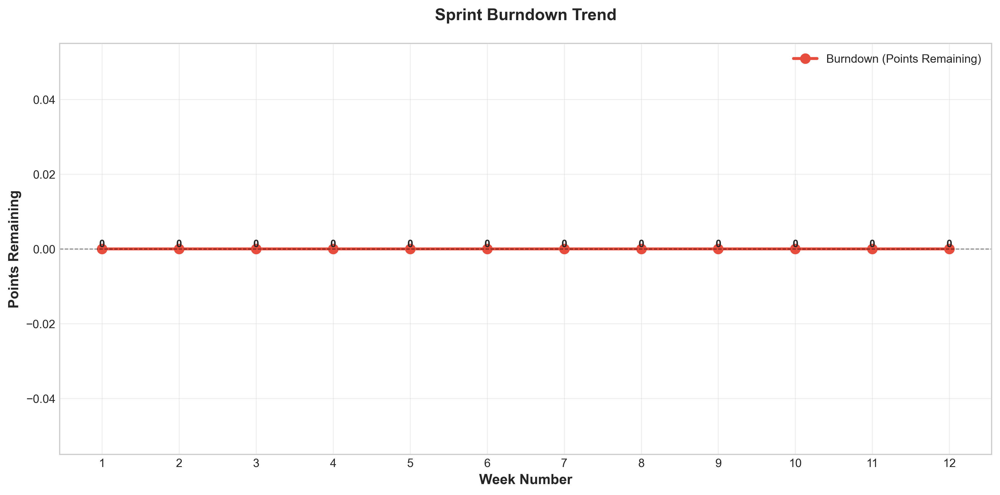
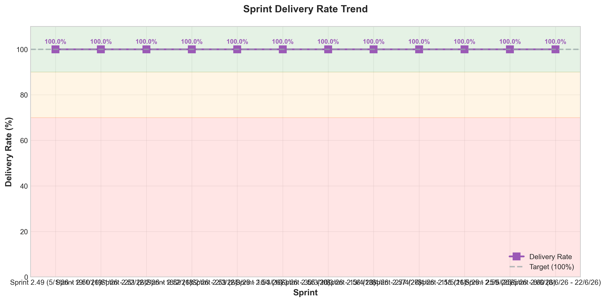

# Sprint Analytics Report - H1 2026
## RnG Squad 2 — abdian.rizki

*Generated: 2026-07-12 22:15:22*

---

## Executive Summary

**Total Sprints Analyzed:** 12

**Total Points Delivered:** 175 / 175

**Average Delivery Rate:** 100.0%

**Average Velocity:** 14.6 points/sprint

### Performance Highlights

**Best Sprint:** Sprint 2.49 (5/1/26 - 19/1/26) (100.0% delivery rate)

**Worst Sprint:** Sprint 2.49 (5/1/26 - 19/1/26) (100.0% delivery rate)

### Key Insights

- Delivery rate remains **consistent** (avg: 100.0%)
- Very **consistent velocity** (σ = 4.77 points)
- **Strong performance**: 12 out of 12 sprints achieved 100%+ delivery rate

## Monthly Velocity Overview

> Target: **12 SP/sprint** (24 SP/month ÷ 2 sprints) | H1 2026 Average: **~14.6 SP/sprint** ✅ Above target

| Month | Sprints | Sprint SPs | Avg SP/Sprint | vs Target (12) | Notes |
|-------|---------|-----------|--------------|----------------|-------|
| January 2026 | 2.49 + 2.50 | 13 + 20 | **16.5 SP** | +4.5 | Strong start |
| February 2026 | 2.51 + 2.52 | 18 + 10 | **14.0 SP** | +2.0 | Imlek holiday (-3 SP est.) |
| March 2026 | 2.53 + 2.54 | 14 + 3 | **8.5 SP** | -3.5 | 🔴 Heavy holiday impact (7 hari kerja hilang) |
| April 2026 | 2.55 + 2.56 | 12 + 17 | **14.5 SP** | +2.5 | Good Friday + recovery |
| May 2026 | 2.57 + 2.58 | 14 + 14 | **14.0 SP** | +2.0 | Labor Day + Ascension Day |
| June 2026 | 2.59 + 2.60 | 21 + 19 | **20.0 SP** | +8.0 | Strong finish |
| **H1 Average** | **12 sprints** | **175 SP total** | **~14.6 SP/sprint** | **+2.6 avg** | **Above target** |

---

## Indonesian Public Holiday Impact Analysis

Sprint points delivered correlate with Indonesian public holidays (SKB 3 Menteri 2026).
Ramadan fasting period excluded from impact analysis per convention.

### Holiday Calendar per Sprint

| Sprint | Period | Tanggal Merah | Hari Libur | Estimated SP Lost |
|--------|--------|--------------|------------|-------------------|
| 2.49 | Jan 5–19 | — | — | 0 SP |
| 2.50 | Jan 19 – Feb 2 | Jan 27 | Isra Mi'raj Nabi Muhammad SAW | ~3 SP |
| 2.51 | Feb 2–18 | Feb 17 | Tahun Baru Imlek 2577 | ~3 SP |
| 2.52 | Feb 18 – Mar 2 | — | — | 0 SP |
| 2.53 | Mar 2–16 | — | — | 0 SP |
| 2.54 | Mar 16–30 | Mar 19, 20, 23, 24 | Nyepi + Cuti Bersama + Idul Fitri | **~12 SP** + personal cuti |
| 2.55 | Mar 30 – Apr 13 | Apr 3 | Jumat Agung (Good Friday) | ~3 SP |
| 2.56 | Apr 13–27 | — | — | 0 SP |
| 2.57 | Apr 27 – May 11 | May 1, May 9 | Hari Buruh + Kenaikan Isa Al-Masih | ~6 SP |
| 2.58 | May 11–25 | — | — | 0 SP |
| 2.59 | May 25 – Jun 8 | May 29, Jun 1 | Hari Raya Waisak + Hari Lahir Pancasila | ~6 SP |
| 2.60 | Jun 8–22 | — | — | 0 SP |

> **Total holiday capacity lost (est.): ~33 SP** from tanggal merah alone

### Sprint 2.54 Deep Dive — Worst Sprint (3 SP)

Sprint 2.54 (Mar 16–30) was the most impacted sprint in H1 2026:

| Tanggal | Keterangan | Jenis |
|---------|-----------|-------|
| Mar 19 (Thu) | Hari Raya Nyepi | 🔴 Tanggal Merah |
| Mar 20 (Fri) | Cuti Bersama Lebaran | 🔴 Tanggal Merah |
| Mar 23 (Mon) | Idul Fitri 1447H Hari ke-1 (Cuti Bersama) | 🔴 Tanggal Merah |
| Mar 24 (Tue) | Idul Fitri 1447H Hari ke-2 (Cuti Bersama) | 🔴 Tanggal Merah |
| Mar 25 (Wed) | Personal Cuti | 🟡 Cuti Pribadi |
| Mar 26 (Thu) | Personal Cuti | 🟡 Cuti Pribadi |
| Mar 27 (Fri) | Personal Cuti | 🟡 Cuti Pribadi |

**Total hari kerja hilang: 7 hari** → estimated ~21 SP capacity lost  
Effective working days left in sprint: ~3 hari → matches actual output of 3 SP

---

## Sprint Points to Man-Days Mapping

| Story Points | Estimasi Durasi | Kapasitas/Hari |
|-------------|----------------|---------------|
| 1 pt | 1–2 jam | ~0.25 hari |
| 2 pt | < 1 hari | ~0.5 hari |
| 3 pt | 1 hari | 1 hari |
| 5 pt | 2–3 hari | 2.5 hari |
| 8 pt | 5 hari (1 minggu) | 5 hari |

### Holiday Impact in Man-Days Equivalent

| Sprint | SP Actual | Hari Kerja Hilang | SP Capacity Lost (est.) | SP Adjusted* |
|--------|-----------|------------------|------------------------|-------------|
| 2.50 | 20 SP | 1 hari (Isra Mi'raj) | ~3 SP | 23 SP |
| 2.51 | 18 SP | 1 hari (Imlek) | ~3 SP | 21 SP |
| 2.53 | 14 SP | — | 0 SP | 14 SP |
| 2.54 | 3 SP | **7 hari** (4 libur + 3 cuti) | **~21 SP** | 24 SP |
| 2.55 | 12 SP | 1 hari (Good Friday) | ~3 SP | 15 SP |
| 2.57 | 14 SP | 2 hari (Buruh + Ascension) | ~6 SP | 20 SP |
| 2.59 | 21 SP | 2 hari (Waisak + Pancasila) | ~6 SP | 27 SP |

*SP Adjusted = Actual + Estimated Capacity Lost (hypothetical without holidays)

> **Total estimated SP capacity lost across H1 2026: ~42 SP**  
> Without holidays, projected H1 total: ~**217 SP** (~36 SP/month)

---

## Personal Cuti H1 2026

| Tanggal | Durasi | Sprint |
|---------|--------|--------|
| Mar 25–27, 2026 | 3 hari | 2.54 |

> Personal cuti terpusat di Sprint 2.54, bersamaan dengan cluster tanggal merah Nyepi + Lebaran.  
> Dampak total Sprint 2.54: hanya 3 hari kerja efektif dari 10 hari sprint.

---

## Visualizations

### Sprint Timeline Overview

*Timeline view of all sprints with delivery performance*

**Legend:**
- 🟢 Green (done) = Perfect delivery (≥100%)
- 🔵 Blue (active) = Good performance (≥75%)
- 🔴 Red (crit) = Needs attention (<75%)

### Sprint Velocity

*Comparison of Points Committed, Delivered, and Carried Over across sprints*

### Burndown Trend

*Points remaining (burndown) over time*

### Delivery Rate

*Percentage of work delivered per sprint (target: 100%)*

## Overall Statistics

| Metric | Value |
|--------|-------|
| Total Committed | 175 points |
| Total Carryover In | 0 points |
| Total Work | 175 points |
| Total Delivered | 175 points |
| Total Carryover Out | 0 points |
| Velocity Consistency (σ) | 4.77 points |

## Sprint-by-Sprint Breakdown

### [Sprint 2.49 (5/1/26 - 19/1/26)](https://app.clickup.com/3708016/v/li/901612829889)

**Jan 5-19, 2026**

📊 **[Sprint Reporting Dashboard](https://app.clickup.com/3708016/v/db/3h53g-283196)**

🌟 **Perfect Sprint!**

| Metric | Value |
|--------|-------|
| 📅 Date Range | Jan 5-19, 2026 |
| 📊 Points Committed | 13 |
| ⬆️ Carryover In | 0 |
| 💼 Total Work | 13 |
| ✅ Points Delivered | 13 |
| ⬇️ Carryover Out | 0 |
| 🔥 Burndown | 0 |
| 🎯 **Delivery Rate** | **100.0%** |
| 📋 Tasks Completed | 6 / 6 |

**Completed Tasks:**

- [[BE][paper-payment-backend] Add disbursement_estimation_date to PID and DDT](https://app.clickup.com/t/86d1f6mn0) - 3 pts
- [[BE] Add AUD data to xb_country_currencies](https://app.clickup.com/t/86d1f43hv) - 1 pts
- [[BE] Adjust endpoint to validate the country](https://app.clickup.com/t/86d1dhr23) - 3 pts
- [[PaperXB] Checking the match between country and SWIFT code in SWIFT Validation checkpoint](https://app.clickup.com/t/86d1davka) - 0 pts
- [[Bug] Product Sync Accuracy Issue Due to Decimal Purchase Price](https://app.clickup.com/t/86d12p56y) - 3 pts
- [[Bug] Unable to pay with VA static using VA Bank Permata on Payper.](https://app.clickup.com/t/86czy81w3) - 3 pts

---

### [Sprint 2.50 (19/1/26 - 2/2/26)](https://app.clickup.com/3708016/v/li/901613100111)

**Jan 19 - Feb 02, 2026**

📊 **[Sprint Reporting Dashboard](https://app.clickup.com/3708016/v/db/3h53g-285296)**

🌟 **Perfect Sprint!**

| Metric | Value |
|--------|-------|
| 📅 Date Range | Jan 19 - Feb 02, 2026 |
| 📊 Points Committed | 20 |
| ⬆️ Carryover In | 0 |
| 💼 Total Work | 20 |
| ✅ Points Delivered | 20 |
| ⬇️ Carryover Out | 0 |
| 🔥 Burndown | 0 |
| 🎯 **Delivery Rate** | **100.0%** |
| 📋 Tasks Completed | 9 / 9 |

**Completed Tasks:**

- [[Tech] Remove disbursement batch status "Approved"](https://app.clickup.com/t/86d1mr5mh) - 1 pts
- [As Finops team, when I view the Disbursement Batch Detail, I want to see the # of disbursement records per batch](https://app.clickup.com/t/86d1mqkpq) - 1 pts
- [[FE] Add filter by manual disbursement](https://app.clickup.com/t/86d1mmzzx) - 3 pts
- [[BE] add isManual flag to the disbursement list records](https://app.clickup.com/t/86d1mmzyf) - 5 pts
- [[Hygiene] As a User, IWT download the filtered data in my PayIn dashboard](https://app.clickup.com/t/86d1k1u0v) - 2 pts
- [[Tech/Data] Handle manual disbursement](https://app.clickup.com/t/86d1jkq9e) - 0 pts
- [[Tech/Data] Show transaction type (payin/payout) and add filter capability in disbursement list, disbursement candidate, and disbursement batch detail](https://app.clickup.com/t/86d1jj79v) - 3 pts
- [[Tech/Data] In disb candidate, add capability to filter by bank name](https://app.clickup.com/t/86d1jj6pw) - 2 pts
- [[Improvement] In menu [Disbursement Batch], add filter by Disbursement ID](https://app.clickup.com/t/86d18vb0r) - 3 pts

---

### [Sprint 2.51 (2/2/26 - 18/2/26)](https://app.clickup.com/3708016/v/li/901613324741)

**Feb 2-18, 2026**

📊 **[Sprint Reporting Dashboard](https://app.clickup.com/3708016/v/db/3h53g-287616)**

🌟 **Perfect Sprint!**

| Metric | Value |
|--------|-------|
| 📅 Date Range | Feb 2-18, 2026 |
| 📊 Points Committed | 18 |
| ⬆️ Carryover In | 0 |
| 💼 Total Work | 18 |
| ✅ Points Delivered | 18 |
| ⬇️ Carryover Out | 0 |
| 🔥 Burndown | 0 |
| 🎯 **Delivery Rate** | **100.0%** |
| 📋 Tasks Completed | 14 / 14 |

**Completed Tasks:**

- [[BE] Return Custom Field on GET api/v1/invoicer/sales-invoices-v2/](https://app.clickup.com/t/86d1tbema) - 2 pts
- [[Custom Field] As a User, IWT See Custom Fields on Sales Invoice View](https://app.clickup.com/t/86d1tbe5m) - 0 pts
- [[BE] Save custom field into custom_document_header](https://app.clickup.com/t/86d1tbbt0) - 3 pts
- [[BE] DELETE Endpoint - DELETE /api/v1/custom-field/{uuid} - Earth](https://app.clickup.com/t/86d1ta8g0) - 2 pts
- [[BE] Update Endpoint - PUT /api/v1/custom-field/{uuid} - Earth](https://app.clickup.com/t/86d1ta652) - 2 pts
- [[BE] company-meta-settings - Invoicer](https://app.clickup.com/t/86d1ta03z) - 2 pts
- [[Custom Field] READ - IWT See Custom Field in company-meta-settings response](https://app.clickup.com/t/86d1t9q71) - 0 pts
- [[Bug] Incorrect Full Payment Processing for Foreign Credit Card Installments](https://app.clickup.com/t/86d1r0n4z) - 2 pts
- [[BE] Create Endpoint - POST /api/v1/custom-field - Earth](https://app.clickup.com/t/86d1kefen) - 2 pts
- [[Custom Field] UPDATE - As a User, IWT Update a Custom Field on SI settings screen](https://app.clickup.com/t/86d1he814) - 0 pts
- [[Custom Field] DELETE - As a User, IWT Delete a Custom Field on SI settings screen](https://app.clickup.com/t/86d1he7yp) - 0 pts
- [[Custom Field] CREATE - As a User, IWT Create a New Custom Field on SI settings screen](https://app.clickup.com/t/86d1he7w1) - 0 pts
- [[Custom Field] As a User, IWT see Custom Fields Render on generated PDFs](https://app.clickup.com/t/86d1c79mt) - 3 pts
- [[Custom Field] As a User, IWT Populate Custom Fields on Sales Invoice](https://app.clickup.com/t/86d1c79em) - 0 pts

---

### [Sprint 2.52 (18/2/26 - 2/3/26)](https://app.clickup.com/3708016/v/li/901613512736)

**Feb 18 - Mar 02, 2026**

📊 **[Sprint Reporting Dashboard](https://app.clickup.com/3708016/v/db/3h53g-288316)**

🌟 **Perfect Sprint!**

| Metric | Value |
|--------|-------|
| 📅 Date Range | Feb 18 - Mar 02, 2026 |
| 📊 Points Committed | 10 |
| ⬆️ Carryover In | 0 |
| 💼 Total Work | 10 |
| ✅ Points Delivered | 10 |
| ⬇️ Carryover Out | 0 |
| 🔥 Burndown | 0 |
| 🎯 **Delivery Rate** | **100.0%** |
| 📋 Tasks Completed | 4 / 4 |

**Completed Tasks:**

- [[BE][paper-import] Read custom field value from api/v1/invoice/upload](https://app.clickup.com/t/86d1ym1m4) - 3 pts
- [[BE][paper-invoicer] Custom field template](https://app.clickup.com/t/86d1ykyep) - 2 pts
- [[EQL Custom Invoice][BE] New PDF for EQL](https://app.clickup.com/t/86d1ykv8n) - 5 pts
- [[Custom Field] Custom field addition for SI bulk import](https://app.clickup.com/t/86d1uhdgd) - 0 pts

---

### [Sprint 2.53 (2/3/26 - 16/3/26)](https://app.clickup.com/3708016/v/li/901613810073)

**Mar 2-16, 2026**

📊 **[Sprint Reporting Dashboard](https://app.clickup.com/3708016/v/db/3h53g-291736)**

🌟 **Perfect Sprint!**

| Metric | Value |
|--------|-------|
| 📅 Date Range | Mar 2-16, 2026 |
| 📊 Points Committed | 14 |
| ⬆️ Carryover In | 0 |
| 💼 Total Work | 14 |
| ✅ Points Delivered | 14 |
| ⬇️ Carryover Out | 0 |
| 🔥 Burndown | 0 |
| 🎯 **Delivery Rate** | **100.0%** |
| 📋 Tasks Completed | 7 / 7 |

**Completed Tasks:**

- [[Same Day DIsbursement] Is same-day disbursement eligibility check](https://app.clickup.com/t/86d252dpz) - 2 pts
- [[BE]](https://app.clickup.com/t/86d24pn12) - 2 pts
- [[Custom Field] When user edit custom field, existing invoice should still show previous custom field](https://app.clickup.com/t/86d24pmmr) - 0 pts
- [[PaperXB] Adjust API https://api.paper.id/api/v1/payment-api/xb/rate to be consumed by public](https://app.clickup.com/t/86d24489c) - 2 pts
- [[Same Day Disbursement] Enable Same-Day Disbursement for Eligible Merchants](https://app.clickup.com/t/86d23bb2q) - 5 pts
- [BE](https://app.clickup.com/t/86d20y62c) - 3 pts
- [[Payment] Adjust AMEX Fee in PayOut & PayIn](https://app.clickup.com/t/86d20y5zx) - 0 pts

---

### [Sprint 2.54 (16/3/26 - 30/3/26)](https://app.clickup.com/3708016/v/li/901614036928)

**Mar 16-30, 2026**

📊 **[Sprint Reporting Dashboard](https://app.clickup.com/3708016/v/db/3h53g-294716)**

🌟 **Perfect Sprint!**

| Metric | Value |
|--------|-------|
| 📅 Date Range | Mar 16-30, 2026 |
| 📊 Points Committed | 3 |
| ⬆️ Carryover In | 0 |
| 💼 Total Work | 3 |
| ✅ Points Delivered | 3 |
| ⬇️ Carryover Out | 0 |
| 🔥 Burndown | 0 |
| 🎯 **Delivery Rate** | **100.0%** |
| 📋 Tasks Completed | 1 / 1 |

**Completed Tasks:**

- [[PaperXB] Add new currencies in DB XB Invoice](https://app.clickup.com/t/86d28vg39) - 3 pts

---

### [Sprint 2.55 (30/3/26 - 13/4/26)](https://app.clickup.com/3708016/v/li/901614250380)

**Mar 30 - Apr 13, 2026**

📊 **[Sprint Reporting Dashboard](https://app.clickup.com/3708016/v/db/3h53g-296196)**

🌟 **Perfect Sprint!**

| Metric | Value |
|--------|-------|
| 📅 Date Range | Mar 30 - Apr 13, 2026 |
| 📊 Points Committed | 12 |
| ⬆️ Carryover In | 0 |
| 💼 Total Work | 12 |
| ✅ Points Delivered | 12 |
| ⬇️ Carryover Out | 0 |
| 🔥 Burndown | 0 |
| 🎯 **Delivery Rate** | **100.0%** |
| 📋 Tasks Completed | 5 / 5 |

**Completed Tasks:**

- [[Bug] Bulk invoice payment request saved as Single PI causing UI sync issues and incorrect notification amounts](https://app.clickup.com/t/86d2kac9f) - 2 pts
- [[Bug] 500 Internal Server Error when downloading Payout Mutation Report for specific date range (October 2025)](https://app.clickup.com/t/86d2jmknj) - 1 pts
- [[Bug] PYOR Disbursement Mismatch due to Race Condition between User Edit and Payment Callback](https://app.clickup.com/t/86d2j932b) - 2 pts
- [[PaperXB] Regex Beneficiary](https://app.clickup.com/t/86d2furvg) - 2 pts
- [[WA Integration] Change from Ivosight to Halosis](https://app.clickup.com/t/86d20yam7) - 5 pts

---

### [Sprint 2.56 (13/4/26 - 27/4/26)](https://app.clickup.com/3708016/v/li/901614370317)

**Apr 13-27, 2026**

📊 **[Sprint Reporting Dashboard](https://app.clickup.com/3708016/v/db/3h53g-297256)**

🌟 **Perfect Sprint!**

| Metric | Value |
|--------|-------|
| 📅 Date Range | Apr 13-27, 2026 |
| 📊 Points Committed | 17 |
| ⬆️ Carryover In | 0 |
| 💼 Total Work | 17 |
| ✅ Points Delivered | 17 |
| ⬇️ Carryover Out | 0 |
| 🔥 Burndown | 0 |
| 🎯 **Delivery Rate** | **100.0%** |
| 📋 Tasks Completed | 8 / 8 |

**Completed Tasks:**

- [[Bug] Batch payment fails to process multiple Pivot SoF records](https://app.clickup.com/t/86d2qcr9t) - 2 pts
- [[Bug] Internal Server Error (UFO) on Create Remitter Data due to State/City Mapping Mismatch](https://app.clickup.com/t/86d2q9h25) - 1 pts
- [[Investigate] Cicilan Doku Error](https://app.clickup.com/t/86d2pbt6v) - 2 pts
- [[Bug] BCA Manual - Automated payment reconciliation applied to wrong invoice due to duplicate unique code and identical amount](https://app.clickup.com/t/86d2nck45) - 3 pts
- [[SI List Download] Add Status Document on XLS from Downloaded SI List](https://app.clickup.com/t/86d2kune4) - 3 pts
- [[BE] adjust downloaded files and adjust api to be able to sort reference no](https://app.clickup.com/t/86d266mv5) - 3 pts
- [[FE]](https://app.clickup.com/t/86d266mnn) - 3 pts
- [[Hygiene] Add Reference No in Recap Pembayaran](https://app.clickup.com/t/86d266mgd) - 0 pts

---

### [Sprint 2.57 (27/4/26 - 11/5/26)](https://app.clickup.com/3708016/v/li/901614676113)

**Apr 27 - May 11, 2026**

📊 **[Sprint Reporting Dashboard](https://app.clickup.com/3708016/v/db/3h53g-300096)**

🌟 **Perfect Sprint!**

| Metric | Value |
|--------|-------|
| 📅 Date Range | Apr 27 - May 11, 2026 |
| 📊 Points Committed | 14 |
| ⬆️ Carryover In | 0 |
| 💼 Total Work | 14 |
| ✅ Points Delivered | 14 |
| ⬇️ Carryover Out | 0 |
| 🔥 Burndown | 0 |
| 🎯 **Delivery Rate** | **100.0%** |
| 📋 Tasks Completed | 4 / 4 |

**Completed Tasks:**

- [[Payment] Create a User Flag to Hide the Inactive Payment Method](https://app.clickup.com/t/86d2ufpm3) - 3 pts
- [fix(pivot-disbursement): process valid items when partial validation or idempotency failure](https://app.clickup.com/t/86d2u8w75) - 3 pts
- [[BE] Change Beneficiary Account Details in PID When Changed from Finops Dashboard](https://app.clickup.com/t/86d2tty1d) - 5 pts
- [[BE] Add a new field in DPR "is_refunded"](https://app.clickup.com/t/86d2tkvth) - 3 pts

---

### [Sprint 2.58 (11/5/26 - 25/5/26)](https://app.clickup.com/3708016/v/li/901614810029)

**May 11-25, 2026**

📊 **[Sprint Reporting Dashboard](https://app.clickup.com/3708016/v/db/3h53g-300876)**

🌟 **Perfect Sprint!**

| Metric | Value |
|--------|-------|
| 📅 Date Range | May 11-25, 2026 |
| 📊 Points Committed | 14 |
| ⬆️ Carryover In | 0 |
| 💼 Total Work | 14 |
| ✅ Points Delivered | 14 |
| ⬇️ Carryover Out | 0 |
| 🔥 Burndown | 0 |
| 🎯 **Delivery Rate** | **100.0%** |
| 📋 Tasks Completed | 9 / 9 |

**Completed Tasks:**

- [[FinOps] Feedback batching](https://app.clickup.com/t/86d3159qx) - 2 pts
- [refactor: xendit CallbackLogging — strategy pattern + batch updates](https://app.clickup.com/t/86d2z9e3p) - 2 pts
- [[BE]](https://app.clickup.com/t/86d2ymuu5) - 2 pts
- [[FE]](https://app.clickup.com/t/86d2ymn7e) - 2 pts
- [[BE]](https://app.clickup.com/t/86d2ymn5z) - 3 pts
- [[Feature Flag] Add Internal Dashboard Toggle for Sales Receipt Date Locking Feature Flag](https://app.clickup.com/t/86d2xmu4j) - 0 pts
- [[Sales receipt] Add Backend Flag to Lock Sales Receipt Dates to Today Only (Prevent Backdating)](https://app.clickup.com/t/86d2x6n1k) - 3 pts
- [[Bug] [Document Labeling] Improve Error Message for Duplicate Label Category Name](https://app.clickup.com/t/86d2ndqe4) - 0 pts
- [[Promo] Create the Blacklist Company ID Feature in Promo Code Level](https://app.clickup.com/t/86d2mb3ep) - 0 pts

---

### [Sprint 2.59 (25/5/26 - 8/6/26)](https://app.clickup.com/3708016/v/li/901615110772)

**May 25 - Jun 08, 2026**

📊 **[Sprint Reporting Dashboard](https://app.clickup.com/3708016/v/db/3h53g-303516)**

🌟 **Perfect Sprint!**

| Metric | Value |
|--------|-------|
| 📅 Date Range | May 25 - Jun 08, 2026 |
| 📊 Points Committed | 21 |
| ⬆️ Carryover In | 0 |
| 💼 Total Work | 21 |
| ✅ Points Delivered | 21 |
| ⬇️ Carryover Out | 0 |
| 🔥 Burndown | 0 |
| 🎯 **Delivery Rate** | **100.0%** |
| 📋 Tasks Completed | 11 / 11 |

**Completed Tasks:**

- [[Improvement] Enable Bank Validation Rate Limit to All Device](https://app.clickup.com/t/86d38t3a3) - 1 pts
- [[Payment BE] Handle Paginated Response in Pivot Payout-Details Callback Ingestion](https://app.clickup.com/t/86d36udug) - 3 pts
- [[paper-payment-backend]](https://app.clickup.com/t/86d33r6e1) - 2 pts
- [[paper-document]](https://app.clickup.com/t/86d33r6c1) - 2 pts
- [[BE] Add label on export csv/xlsx](https://app.clickup.com/t/86d33r5dz) - 3 pts
- [[Improvement] Payment - Add Timer for DigitalPaymentCallback](https://app.clickup.com/t/86d333y6u) - 0 pts
- [[Backend] Handle Multiple Pivot Callbacks with Different Events](https://app.clickup.com/t/86d32t7dj) - 3 pts
- [[BE]](https://app.clickup.com/t/86d2yn4ya) - 5 pts
- [[Bug] BCA Static VA Closed Amount Payments Show as 0 Due to Decimal Formatting](https://app.clickup.com/t/86d2tqcyn) - 2 pts
- [[Document Labeling - Improvement] Add Label Column to Bulk Download Sales Invoice List Pop-Up View & Excel File (Web & Mobile)](https://app.clickup.com/t/86d2nbgqb) - 0 pts
- [[Document Labeling - Improvement] Add Field Labeling to Create & Edit Form Single Sales Invoice (Web & Mobile)](https://app.clickup.com/t/86d2nb6vp) - 0 pts

---

### [Sprint 2.60 (8/6/26 - 22/6/26)](https://app.clickup.com/3708016/v/li/901615248893)

**Jun 8-22, 2026**

📊 **[Sprint Reporting Dashboard](https://app.clickup.com/3708016/v/db/3h53g-304936)**

🌟 **Perfect Sprint!**

| Metric | Value |
|--------|-------|
| 📅 Date Range | Jun 8-22, 2026 |
| 📊 Points Committed | 19 |
| ⬆️ Carryover In | 0 |
| 💼 Total Work | 19 |
| ✅ Points Delivered | 19 |
| ⬇️ Carryover Out | 0 |
| 🔥 Burndown | 0 |
| 🎯 **Delivery Rate** | **100.0%** |
| 📋 Tasks Completed | 6 / 6 |

**Completed Tasks:**

- [[Improvement] Improve Idempotency Logic for Payment Gateway Fallback and Retries](https://app.clickup.com/t/86d393m8a) - 3 pts
- [[BE] Add SoF to PID and DDT](https://app.clickup.com/t/86d38xrkr) - 3 pts
- [[BE] PDF](https://app.clickup.com/t/86d38xrhm) - 3 pts
- [[mrkrabs] Slack Bot — Routing Payment Method to PIVOT](https://app.clickup.com/t/86d37ce0x) - 5 pts
- [[Improvement] Payment -  Log all tokopedia trx every scheduler runs](https://app.clickup.com/t/86d2r3pq9) - 5 pts
- [[Payment] Adjust Mutation/Sender Name on Payment Pending Page & Payment Receipt Based on Disbursement SOF + Update Paper Logo](https://app.clickup.com/t/86d2mb4vg) - 0 pts

---

---

## About This Report

This report was automatically generated by the Sprint Analytics system.

**Report Contents:**

- Executive summary with key performance indicators
- Visual charts for velocity, burndown, and delivery rate
- Detailed sprint-by-sprint breakdown with task lists
- Indonesian public holiday indicators
- Automated insights and recommendations

**Files Generated:**

- `sprint_summary.md` - This comprehensive report
- `sprint_metrics.json` - Complete data in JSON format
- `sprint_metrics.csv` - Summary data for Excel/Sheets
- `sprint_velocity_chart.png` - Velocity comparison chart
- `sprint_burndown_chart.png` - Burndown trend chart
- `sprint_delivery_rate_chart.png` - Delivery rate chart

**Legend:**

- 🌟 Perfect Sprint (≥100% delivery)
- ✅ Excellent Performance (90-99%)
- 👍 Good Performance (75-89%)
- ⚠️ Needs Improvement (50-74%)
- ❌ Critical (<50%)
- 🔴 Tanggal Merah (Indonesian Public Holiday)
